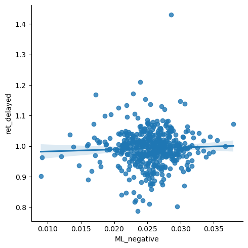

# Final Report: Assignment 5 a.k.a Midterm
### Mason Otley
This file is the final report of the work done in this repo. It will contain my analysis of the process and results of the sentiment analysis done on firms in the S&P500. To help illustrate the insights gained in this analysis, this report will include some code which will generate regressions and plots which illustrate the relationship between the return variables and various sentiment variables. This report will seek to answer the question of how firms' stock returns are effected in the short term by the release of their 10K files, and how the sentiment of their 10K file can affect the reaction of the stock price. 

## Section I: Data
### 10K Files
The sample for the sentiment analysis, which was built in build_sample.ipynb and saved as analysis_sample.cvs, contains data for 495 S&P500 companies. While there are currently 503 companies in the index, some were dropped along the way due to no 10K filing in the calendar year 2022. The inital data that was downloaded was from the S&P500's Wikipedia page, and provided information regarding companies' industry, headquarter location, date added to the index, etc. In order to obtain a sample that could run the desired sentiment analysis, new variables needed to be added to the initial data frame. 

The first variable added was the '10K' variable, which opened the zip file that was made in download_text_files_ipynb and put the correct company's 10K in its respective row. To do this, a for loop was written, with the zip file open, to iterate through the 'Symbol' column of the data frame, thus matching a generated file name to a file within the zip. Once a match was found, the file was opened and saved in a new column in the data frame. There was a few companies that did not yield a matching 10K file, so those rows were dropped. Based on the number of observations dropped in this step, it was decided that the impact was marginal, and would not impact the sentiment analysis is a significant manner. 

With the 10K files saved in the data frame, another for loop was written to iterate through the 10K column and clean the text of the html files. The text was converted to lower case, punctuation was removed, and white space was limited to a maximum of a singe space. These cleaned html files were then saved to a new column in the data frame calles 'Clean_10K'. 

In order to answer the question of the immediate and short-term effects of 10K filings on stock returns, the date of each companies' 10K filings needed to be known. This date could be retrieved from the web on the SEC EDGAR database by matching the filing's CIK and accession number to the database URL. While the data contained a CIK variable already, it did not have an accession number variable. This variable was achieved by splitting the strings in the file_list, which was the list of html files. The files accession number was part of the file name, so by splitting the string (file name) at the '/' marks, it could be isolated and stored in a new data frame column. 
```
parts = [i.split('/')[3] for i in file_list]
sp500 = sp500.assign(accession_number = parts)
```

Once the accession number variable was added, a for loop was written to iterate through the CIK and accession number variables to retrieve the filing date from the SEC EDGAR database. The date was then stored in a new variable titled '10K_date'.

### Stock Returns
Stock return data for the year 2022 was downloaded from the data repo on Github and loaded in the same was as Compustat data had been loaded in past assignments. Two variables needed to be made from this data: immediate returns which include the day of the filing and the two days following, and delayed returns which include the week following the immediate returns. 

To separate the immediate returns and delayed returns, the '10K_date' variable was merged into the returns data, and the data was filtered based on the day's proximity to the filing date. The DateOffset was set to 12 days to account for at least one weekend interrupting the returns data. 
```
merge1.drop(merge1[merge1['date'] >= merge1['10K_date'] + pd.DateOffset(days=12)].index, inplace = True)
merge1.drop(merge1[merge1['date'] < merge1['10K_date']].index, inplace = True)

merge_ST = (merge1.drop(merge1[merge1['date'] >= merge1['10K_date'] + pd.DateOffset(days=3)].index, inplace = False))
merge_LT = (merge1.drop(merge1[merge1['date'] <= merge1['10K_date'] + pd.DateOffset(days=3)].index, inplace = False))

```
Following the filtering step, there were two data frame of returns data, one for the immediate returns (merge_ST) and one for the delayed returns (merge_LT). The cumulative returns for each company was calculated in a similar manner to assignment 2, and a groupby function was used to consolidate each companies' data and isolate the .tail(1) of the cumulative returns. 
```
merge_ST = merge_ST.assign(R=1+merge_ST['ret']).assign(cumret = lambda x: x.groupby(['Symbol'])['R'].cumprod())
merge_ST = merge_ST.groupby(['Symbol']).tail(1)
```
Since the returns were cumulative, the final value of the cumret variable for each company represents the cumulative price movement of the share price. The cumulative return variables were merged into the original S&P500 data frame as 'ret_immediate' and 'ret_delayed'. 

### Sentiment Variables
*Note: Due to a time crunch, I was only able to create the first four sentiment variables. Since I was unable to run a sentiment analysis on any contextual variables, there will be no part regarding these variables. 

To calculate a sentiment score for each firms' 10K filing, four sentiment dictionaries were used to match positive and negative words to the words in the 'Clean_10K' variable. After loading in the dictionaries and fiddling with the LM_MasterDictionary_1993-2021.csv file to isolate and separate the positive and negative words, the dictionaries were converted into lists and standardized in a similar way that the 10K files were cleaned. 
```
LM_negative = (LM_master.drop(LM_master[LM_master['Negative'] == 0].index, inplace = False))
LM_positive = (LM_master.drop(LM_master[LM_master['Positive'] == 0].index, inplace = False))

```

To make NEAR.regex work better, the lists were also changed to include a '|' between each word. A for loop was then used to iterate through the 'Clean_10K' column and calculate the sentiment score of each file:
```
for index, row in sp500ret.iterrows():
    file = row['Clean_10K']
    sp500ret.loc[index, "LM_negative"] = (len(re.findall(NEAR_regex(LM_negative_regex),file))
                                        /
                                        len(file.split()))for index, row in sp500ret.iterrows():
```
This for loop iterated through the 'Clean_10K' column, calculated the number of words matching the LM_negative_regex dictionary, and divides by the files total length, thus returning a ratio of the number of negative words. This number is then stored in a new variable titled "LM_negative". This step was repeated four times to create the four sentiment variables.

### Summary Statistics


```python
import pandas as pd

sample = pd.read_csv('output/analysis_sample.csv')
sample.describe()
```


<div>
<style scoped>
    .dataframe tbody tr th:only-of-type {
        vertical-align: middle;
    }

    .dataframe tbody tr th {
        vertical-align: top;
    }

    .dataframe thead th {
        text-align: right;
    }
</style>
<table border="1" class="dataframe">
  <thead>
    <tr style="text-align: right;">
      <th></th>
      <th>Unnamed: 0</th>
      <th>CIK</th>
      <th>ret_immediate</th>
      <th>ret_delayed</th>
      <th>LM_negative</th>
      <th>LM_positive</th>
      <th>ML_negative</th>
      <th>ML_positive</th>
    </tr>
  </thead>
  <tbody>
    <tr>
      <th>count</th>
      <td>495.000000</td>
      <td>4.950000e+02</td>
      <td>491.000000</td>
      <td>490.000000</td>
      <td>495.000000</td>
      <td>495.000000</td>
      <td>495.000000</td>
      <td>495.000000</td>
    </tr>
    <tr>
      <th>mean</th>
      <td>247.000000</td>
      <td>7.889460e+05</td>
      <td>1.005945</td>
      <td>0.993009</td>
      <td>0.016350</td>
      <td>0.006667</td>
      <td>0.025462</td>
      <td>0.023409</td>
    </tr>
    <tr>
      <th>std</th>
      <td>143.038456</td>
      <td>5.537627e+05</td>
      <td>0.042024</td>
      <td>0.059297</td>
      <td>0.003877</td>
      <td>0.001546</td>
      <td>0.003695</td>
      <td>0.004079</td>
    </tr>
    <tr>
      <th>min</th>
      <td>0.000000</td>
      <td>1.800000e+03</td>
      <td>0.720770</td>
      <td>0.787670</td>
      <td>0.002541</td>
      <td>0.000815</td>
      <td>0.008953</td>
      <td>0.003530</td>
    </tr>
    <tr>
      <th>25%</th>
      <td>123.500000</td>
      <td>9.734300e+04</td>
      <td>0.982820</td>
      <td>0.966441</td>
      <td>0.013850</td>
      <td>0.005575</td>
      <td>0.023522</td>
      <td>0.021464</td>
    </tr>
    <tr>
      <th>50%</th>
      <td>247.000000</td>
      <td>8.828350e+05</td>
      <td>1.003336</td>
      <td>0.996657</td>
      <td>0.016075</td>
      <td>0.006660</td>
      <td>0.025688</td>
      <td>0.023780</td>
    </tr>
    <tr>
      <th>75%</th>
      <td>370.500000</td>
      <td>1.137334e+06</td>
      <td>1.030235</td>
      <td>1.021957</td>
      <td>0.018393</td>
      <td>0.007626</td>
      <td>0.027597</td>
      <td>0.025810</td>
    </tr>
    <tr>
      <th>max</th>
      <td>494.000000</td>
      <td>1.868275e+06</td>
      <td>1.191172</td>
      <td>1.429530</td>
      <td>0.035088</td>
      <td>0.012126</td>
      <td>0.037938</td>
      <td>0.037721</td>
    </tr>
  </tbody>
</table>
</div>


The resulting data sample produces the summary statistics above. With 495 observations, there are still plenty of companies to run the sentiment analysis as the dropna steps only got rid of a hand full of observations. The mean of 'ret_immediate' and 'ret_delayed' are both close to 1. Since we only looked ten days into the future, it can be expected that cumulative return and price movement of shares are, on average, not very significant. It also seems like on average, 10K files tend to contain more negative words than positive words. This is somewhat surprising, but this analysis is imperfect so it is difficult to understand whether the language is truly more negative than positive. Also, since the data and filings are from 2022, it can also be assumed that the macroeconomic conditions were not favorable for many businesses. 

There is some variance among the mean values for the LM and ML dictionaries. In general, it seems that ML dictionaries, produced more matched than the LM dictionary, particularly LM_positive. This is likely due to the fact that ML provided a more extensive list of words than LM, thus producing more matches when running the findall function. This affects the raw sentiment score compared to other dictionaries, but should word for the regression analysis. Since the regression only measures the relative relationship between the sentiment score and returns, the magnitude of the sentiment score does not necessarily matter. 

## Section II: Results
This section will analyze and interpret the data gathered in the sample data. 


```python
returns = ['ret_immediate','ret_delayed']
sentiment = ['LM_negative','LM_positive','ML_negative','ML_positive'] 
table = sample[returns + sentiment].corr()
corr_table = table.iloc[:-4,2:] # drop the rows and columns not needed
corr_table
```


<div>
<style scoped>
    .dataframe tbody tr th:only-of-type {
        vertical-align: middle;
    }

    .dataframe tbody tr th {
        vertical-align: top;
    }

    .dataframe thead th {
        text-align: right;
    }
</style>
<table border="1" class="dataframe">
  <thead>
    <tr style="text-align: right;">
      <th></th>
      <th>LM_negative</th>
      <th>LM_positive</th>
      <th>ML_negative</th>
      <th>ML_positive</th>
    </tr>
  </thead>
  <tbody>
    <tr>
      <th>ret_immediate</th>
      <td>-0.018129</td>
      <td>-0.08243</td>
      <td>0.033629</td>
      <td>0.054914</td>
    </tr>
    <tr>
      <th>ret_delayed</th>
      <td>-0.109026</td>
      <td>-0.01554</td>
      <td>0.040660</td>
      <td>-0.050855</td>
    </tr>
  </tbody>
</table>
</div>


This figure shows the correlation of the immediate and delayed returns with the sentiment variables. The results do not provide any clear insights into a cause-and-effect relationship between variables. It would be intuitive to think that positive 10K files would help generate positive returns, but the relationship between ML_positive and ret_immediate is the only positive relationship. With just one positive dictionary yielding a positive correlation in the immediate and delayed returns, it calls into question the validity of the analysis. Additionally, there is a positive correlation between ML_negative and returns in both the immediate and delayed time frames. Based on this table, it cannot be concluded that there is a cause-and-effect relationship between 10K sentiment and stock price returns. 

Additional problems arise when a regression is performed on the same data:


```python
import numpy as np
from statsmodels.formula.api import ols as sm_ols

sample = (sample
                  # create variables
                  .assign(l_LM_negative = np.log(sample['LM_negative']),
                          l_LM_positive = np.log(sample['LM_positive']),
                          l_ML_negative = np.log(sample['ML_negative']),
                          l_ML_positive = np.log(sample['ML_positive'])))
sm_ols("ret_immediate ~ l_LM_negative + l_LM_positive + l_ML_negative + l_ML_positive", data = sample).fit().summary()

```


<table class="simpletable">
<caption>OLS Regression Results</caption>
<tr>
  <th>Dep. Variable:</th>      <td>ret_immediate</td>  <th>  R-squared:         </th> <td>   0.017</td>
</tr>
<tr>
  <th>Model:</th>                   <td>OLS</td>       <th>  Adj. R-squared:    </th> <td>   0.009</td>
</tr>
<tr>
  <th>Method:</th>             <td>Least Squares</td>  <th>  F-statistic:       </th> <td>   2.113</td>
</tr>
<tr>
  <th>Date:</th>             <td>Fri, 24 Mar 2023</td> <th>  Prob (F-statistic):</th>  <td>0.0781</td> 
</tr>
<tr>
  <th>Time:</th>                 <td>13:24:37</td>     <th>  Log-Likelihood:    </th> <td>  864.27</td>
</tr>
<tr>
  <th>No. Observations:</th>      <td>   491</td>      <th>  AIC:               </th> <td>  -1719.</td>
</tr>
<tr>
  <th>Df Residuals:</th>          <td>   486</td>      <th>  BIC:               </th> <td>  -1698.</td>
</tr>
<tr>
  <th>Df Model:</th>              <td>     4</td>      <th>                     </th>     <td> </td>   
</tr>
<tr>
  <th>Covariance Type:</th>      <td>nonrobust</td>    <th>                     </th>     <td> </td>   
</tr>
</table>
<table class="simpletable">
<tr>
        <td></td>           <th>coef</th>     <th>std err</th>      <th>t</th>      <th>P>|t|</th>  <th>[0.025</th>    <th>0.975]</th>  
</tr>
<tr>
  <th>Intercept</th>     <td>    1.0021</td> <td>    0.049</td> <td>   20.605</td> <td> 0.000</td> <td>    0.907</td> <td>    1.098</td>
</tr>
<tr>
  <th>l_LM_negative</th> <td>   -0.0020</td> <td>    0.009</td> <td>   -0.229</td> <td> 0.819</td> <td>   -0.019</td> <td>    0.015</td>
</tr>
<tr>
  <th>l_LM_positive</th> <td>   -0.0222</td> <td>    0.009</td> <td>   -2.478</td> <td> 0.014</td> <td>   -0.040</td> <td>   -0.005</td>
</tr>
<tr>
  <th>l_ML_negative</th> <td>    0.0090</td> <td>    0.016</td> <td>    0.562</td> <td> 0.574</td> <td>   -0.023</td> <td>    0.041</td>
</tr>
<tr>
  <th>l_ML_positive</th> <td>    0.0219</td> <td>    0.011</td> <td>    1.954</td> <td> 0.051</td> <td>   -0.000</td> <td>    0.044</td>
</tr>
</table>
<table class="simpletable">
<tr>
  <th>Omnibus:</th>       <td>68.037</td> <th>  Durbin-Watson:     </th> <td>   2.039</td> 
</tr>
<tr>
  <th>Prob(Omnibus):</th> <td> 0.000</td> <th>  Jarque-Bera (JB):  </th> <td> 534.078</td> 
</tr>
<tr>
  <th>Skew:</th>          <td>-0.260</td> <th>  Prob(JB):          </th> <td>1.06e-116</td>
</tr>
<tr>
  <th>Kurtosis:</th>      <td> 8.083</td> <th>  Cond. No.          </th> <td>    221.</td> 
</tr>
</table><br/><br/>Notes:<br/>[1] Standard Errors assume that the covariance matrix of the errors is correctly specified.


```python
sm_ols("ret_delayed ~ l_LM_negative + l_LM_positive + l_ML_negative + l_ML_positive", data = sample).fit().summary()

```


<table class="simpletable">
<caption>OLS Regression Results</caption>
<tr>
  <th>Dep. Variable:</th>       <td>ret_delayed</td>   <th>  R-squared:         </th> <td>   0.029</td>
</tr>
<tr>
  <th>Model:</th>                   <td>OLS</td>       <th>  Adj. R-squared:    </th> <td>   0.021</td>
</tr>
<tr>
  <th>Method:</th>             <td>Least Squares</td>  <th>  F-statistic:       </th> <td>   3.659</td>
</tr>
<tr>
  <th>Date:</th>             <td>Fri, 24 Mar 2023</td> <th>  Prob (F-statistic):</th>  <td>0.00599</td>
</tr>
<tr>
  <th>Time:</th>                 <td>13:24:37</td>     <th>  Log-Likelihood:    </th> <td>  696.85</td>
</tr>
<tr>
  <th>No. Observations:</th>      <td>   490</td>      <th>  AIC:               </th> <td>  -1384.</td>
</tr>
<tr>
  <th>Df Residuals:</th>          <td>   485</td>      <th>  BIC:               </th> <td>  -1363.</td>
</tr>
<tr>
  <th>Df Model:</th>              <td>     4</td>      <th>                     </th>     <td> </td>   
</tr>
<tr>
  <th>Covariance Type:</th>      <td>nonrobust</td>    <th>                     </th>     <td> </td>   
</tr>
</table>
<table class="simpletable">
<tr>
        <td></td>           <th>coef</th>     <th>std err</th>      <th>t</th>      <th>P>|t|</th>  <th>[0.025</th>    <th>0.975]</th>  
</tr>
<tr>
  <th>Intercept</th>     <td>    0.9861</td> <td>    0.068</td> <td>   14.425</td> <td> 0.000</td> <td>    0.852</td> <td>    1.120</td>
</tr>
<tr>
  <th>l_LM_negative</th> <td>   -0.0410</td> <td>    0.012</td> <td>   -3.395</td> <td> 0.001</td> <td>   -0.065</td> <td>   -0.017</td>
</tr>
<tr>
  <th>l_LM_positive</th> <td>    0.0089</td> <td>    0.013</td> <td>    0.708</td> <td> 0.479</td> <td>   -0.016</td> <td>    0.034</td>
</tr>
<tr>
  <th>l_ML_negative</th> <td>    0.0667</td> <td>    0.023</td> <td>    2.954</td> <td> 0.003</td> <td>    0.022</td> <td>    0.111</td>
</tr>
<tr>
  <th>l_ML_positive</th> <td>   -0.0337</td> <td>    0.016</td> <td>   -2.141</td> <td> 0.033</td> <td>   -0.065</td> <td>   -0.003</td>
</tr>
</table>
<table class="simpletable">
<tr>
  <th>Omnibus:</th>       <td>103.822</td> <th>  Durbin-Watson:     </th> <td>   2.044</td> 
</tr>
<tr>
  <th>Prob(Omnibus):</th> <td> 0.000</td>  <th>  Jarque-Bera (JB):  </th> <td> 888.680</td> 
</tr>
<tr>
  <th>Skew:</th>          <td> 0.642</td>  <th>  Prob(JB):          </th> <td>1.06e-193</td>
</tr>
<tr>
  <th>Kurtosis:</th>      <td> 9.471</td>  <th>  Cond. No.          </th> <td>    221.</td> 
</tr>
</table><br/><br/>Notes:<br/>[1] Standard Errors assume that the covariance matrix of the errors is correctly specified.


Above, we see two regressions: the first analyzed the linear relationship between the sentiment variables and the immediate stock returns (t - t+2). The second analyzed the linear relationship between the sentiment variables and the delayed stock returns (t+3 - t+10). 

The intercept coefficient is tells us that in general, the immediate cumulative returns (1.0021) are higher than that of the delayed cumulative returns (0.9861). This tells us one of two things. First, it is possible that the release of a 10K filing gives shares a boost as it reengages investors and possible boosts shareholder confidence regardless of sentiment score. The intercept coefficient is just 0.0021 above 1.0, however, which leads into the next possibility. It could also be possible that the macroeconomic conditions caused an index-wide downward trend. Since the delayed cumulative returns take into account a longer time period, it is more likely to pick up on broad market trends. This could explain the intercept coefficient being less than 1.0 due to the ongoing recession concerns in 2022. 

Similar to the correlation table, the regression coefficients do not suggest a causal relationship between 10K sentiment and stock returns. The strongest relationship occurs with the ML_negative library and delayed returns (0.0667). The strongest correlation occurring with a negative sentiment variable is, once again, not intuitive.


```python
import seaborn as sns

sns.lmplot(data=sample,x='ML_negative',y='ret_delayed')
```


    <seaborn.axisgrid.FacetGrid at 0x7ff621401400>


    

    


Based on the visualization above, there seems to be very little correlation between these two variables, yet this is actually the **strongest** correlation of any of the variables tested. This goes to show that the sentiment analysis done in this repo did not return strong results as they relate to correlation or regression. 

Seeing the lack of correlation between the sentiment and return variables, I regret not getting to include contextual sentiment variables. The raw ML and LM variables can, in theory, reflect the general tone of the 10K, but many word can and will be taken out of context, generating false positives and false negatives. This analysis could be greatly improved if the sentiment dictionaries were only counted when a word came up close to another word. For instance, if only positive and negative words were counted around words like earning, EPS, profit, etc., it would likely reflect a much more positive 10K as it pertains to the company's earnings. This would be far more likely to generate causal relationships, as it can gauge the quality of the company's earnings which has a direct impact on stock price. 

### Conclusion
While the code in this repo generated results for sentiment variables and stock returns, there was no apparent relationship between 10K sentiment and the stock returns around the filing date. Of course, this analysis is imperfect in many ways, so it is not surprising that imperfect results were generated. A large part of this analysis was also left off, regrettably, which may have had the ability to improve the results of the sentiment analysis. Regardless, there are some takeaways that can be made following this study. 

First, using raw sentiment dictionaries is not an optimal method for measuring the sentiment of a 10K document. For some documents it may be fine, but the business formal language and elaborate nature of corporate 10K filings make for frequent possibility of false positive and false negative, thus convoluting the true sentiment of the document. 

Second, the results suggest that the release of a 10K filing could have a generally positive effect on stock price. While this effect may be marginal, the regression run in this report showed that immediate stock returns tended to be higher than those of the following week after the 10K was filed. This takeaway is intuitive since 10K filings can help build shareholder trust and morale, thus giving stock prices a boost. Considering the challenging macroeconomic environment of 2022, achieving an intercept coefficient greater than 1.0 for immediate returns was noteworthy. 
